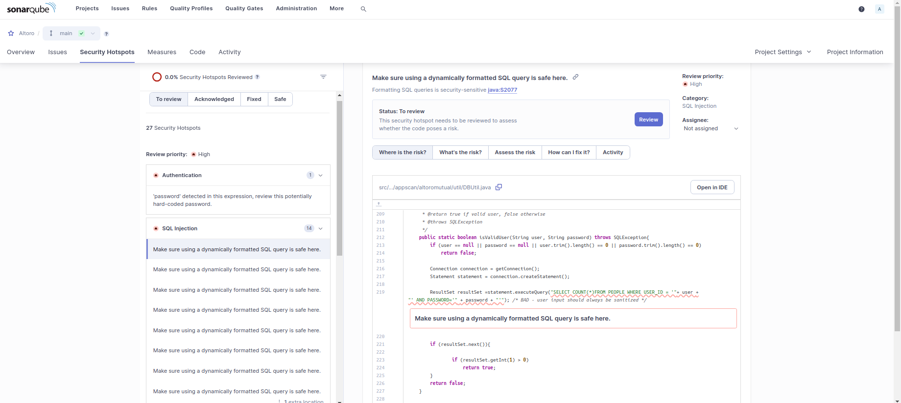
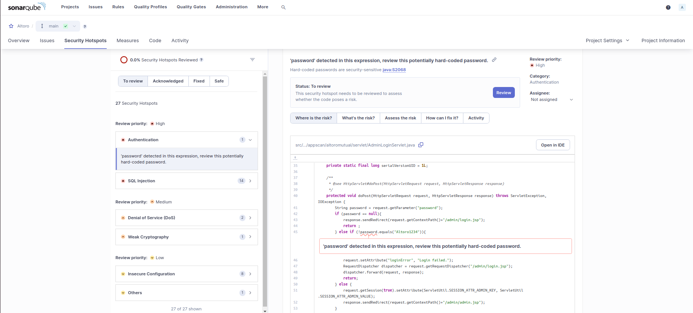

# Resumen Ejecutivo

## Resultados de SonarQube vs vulnerabilidades previamente identificadas. 

De las vulneravilidades identidicadas en los Security Hotspots de Sonarqube, hay dos que coinciden con las vulnerabilidades vistas en prácticos anteriores.

1. SQL Injection

2. Hard-coded credentials

## Falsos positivos identificados.

Luego de analizar las vulnerabilidades detectadas por SonarQube, no se logró identificar ningún falso positivo.

## Falsos negativos identificados. 

Comparando los hallazgos de SonarQube con las vulnerabilidades previamente identificadas en los prácticos, se encontraron varios falsos negativos. 

**Estas son vulnerabilidades que no fueron detectadas por la herramienta en su análisis:**

1. **Improper Input Validación:** Ocurre cuando la aplicación no valida adecuadamente las entradas del usuario.
*Motivo del falso negativo:* La versión Community no realiza rastreo de flujo de datos ni aplica reglas avanzadas para verificar si los datos de entrada alcanzan sinks inseguros.

2. **Inyección  de Comando:** Permite a un atacante ejecutar comandos en el SO mediante entradas no validadas.
*Motivo del falso negativo:*
La versión Community no está equipada con análisis profundo para detectar vulnerabilidades que involucran la ejecución dinámica de comandos.

3. **Path Transversal:** Consiste en manipular rutas de archivos para acceder a ubicaciones no autorizadas en el servidor.
       *Motivo del falso negativo:*
Para identificarla se suele requerir rastreo de flujo de datos para identificar si las entradas del usuario alcanzan operaciones de archivos sin una validación o sanitización adecuada.

4. **Missing Authorization:** Ocurre cuando no se implementa un control adecuado de autorización para verificar si el usuario tiene permiso para realizar una acción.
      *Motivo del falso negativo:*
Esta vulnerabilidad no se detecta fácilmente mediante análisis estático, ya que implica entender el flujo lógico de la aplicación y verificar controles de acceso.

5. **Missing Autorizathion for critical function:** Es similar al problema anterior, aplicada a funciones críticas que deben estar protegidas mediante controles de acceso estrictos.
      *Motivo del falso negativo:*
Al igual que con el caso anterior, requiere análisis de lógica de negocio y flujo de datos, que no están disponibles en la edición Community.

## Limitaciones de la versión Community de SonarQube en el análisis de archivos JSP.  
La versión Community no analiza el codigo Java dentro de los archivos JSP. 
El rastreo avanzado de datos para archivos JSP solo está disponible a partir de la edición Developer de SonarQube (v8.3+).

## Limitaciones de los tipos de vulnerabilidades que puede detectar la versión Community SonarQube. 

**1. No realiza un rastreo de flujo de datos**
No realiza un analisis profundo para detectar problemas inyecciones SQL, ya que no verifica si:**

   a. La entrada proviene de una fuente externa (introducida por un usuario), es decir, no rastrea si una variable está "manchada" con datos no confiables.
   
   b. Los datos inseguros alcanzan un "sink" (punto de riesgo) vulnerable, como un método de ejecución SQL, sin ser sanitizados.

**El rastreo de flujo de datos está disponible a partir de la edición Developer, como se indica en sus características:**
"Configuración personalizada del motor de seguridad para un análisis de manchas más potente"

Esto significa que la Community no analiza cómo los datos fluyen a través de diferentes componentes en el código ni detecta vulnerabilidades que dependen de este análisis.

**Nota:** Aunque puede detectar inyecciones SQL a través de Security Hotspots, este enfoque solo utiliza reglas simples que buscan patrones estáticos comunes en el código. 

**2. Se limita a errores básicos como código muerto, mal uso de variables o complejidad alta.**
Debido a que:

La Community realiza únicamente análisis estático básico, como se indica en sus características:
"Detectar errores y vulnerabilidades básicas en el código" y "Revisión de los puntos de acceso de seguridad".
**Esto se traduce en problemas menores como:**

a. Variables no utilizadas (Código que reserva memoria pero no se ejecuta)

b. Código duplicado (Fragmentos repetidos que dificultan el mantenimiento)

c. complejidad ciclomatica alta (Código con demasiadas ramificaciones o caminos posibles, lo que lo hace difícil de entender, probar y mantener)

**La edición Developer amplía esta capacidad con:**
"Análisis de contaminación con SAST más profundo para Java, C#, JavaScript y TypeScript" y "Detección de errores avanzados que causan errores de tiempo de ejecución y bloqueos".

**3. No detecta vulnerabilidades avanzadas ni problemas de configuración**. 
*No detecta:* Deserialización insegura, Cross-Site Scripting (XSS) ni problemas de configuración de seguridad, como credenciales por defecto o malas configuraciones de permisos.
Esto se debe a la falta de motores avanzados de análisis estático de seguridad (SAST) y rastreo de flujo de datos, que solo están disponibles en las ediciones Developer y superiores. 
